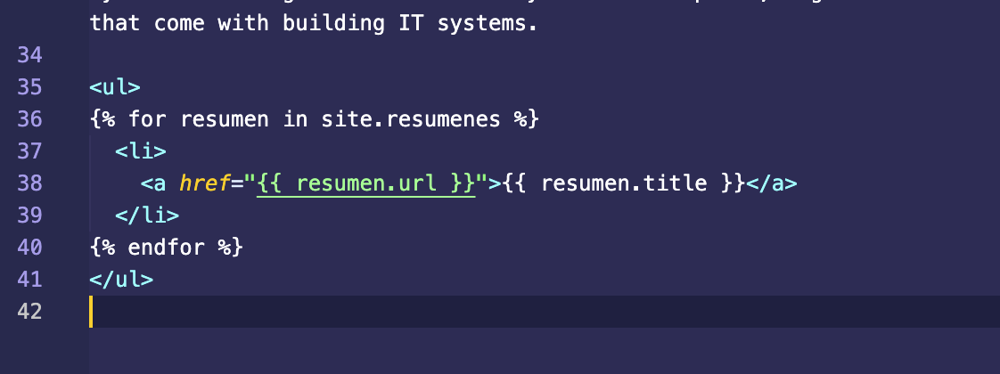

# Resumen de Desarrollo de Sistemas: Una Práctica Usando Jekyll y GitHub Pages

## Descripción

Este proyecto incluye un resumen del Capítulo 1 del libro "Developing Information Systems: Practical Guidance for IT Professionals", junto con un sitio web desplegado usando Jekyll y GitHub Pages.

## Tabla de Contenidos

- [Resumen del Capítulo 1](#resumen-del-capítulo-1)
- [Despliegue en Jekyll y GitHub Pages](#despliegue-en-jekyll-y-github-pages)
- [Despliegue en Netlify](#despliegue-en-netlify)
- [Página 404 Personalizada](#página-404-personalizada)
- [Kanban Board](#kanban-board)
- [Jekyll Collection](#jekyll-collection)
- [Uso de Liquid y Archivos de Datos](#uso-de-liquid-y-archivos-de-datos)
- [Uso de archivos `.csv` o `.json` en `_data`](#uso-de-archivos-csv-o-json-en-_data)
- [Configuración de `_config.yml`](#configuración-de-_configyml)
- [Entrega](#entrega)

## Rúbrica

- [x] **Se ha desplegado el sitio Web en GitHub pages usando Jekyll**
- [x] **Se resumen correctamente los conceptos del capítulo**
- [x] **Kanban Board project conteniendo las incidencias de la rúbrica**
- [x] **Despliegue en Netlify**
- [x] **Se ha creado una Jekyll Collection**
- [x] **Se ha hecho uso de Liquid** (mostrar ejemplos en el informe)
- [x] **Se ha hecho uso de un `.csv` o `.json` en `_data`** (mostrar ejemplos en el informe)
- [x] **Se ha reconfigurado los defaults del `_config.yml`**
- [x] **Página 404 personalizada**
- [x] **Página personal en GitHub Pages**
- [x] **Página personal en GitHub Pages enlazada desde el perfil GitHub del alumno**
- [x] **Entrega del `.zip` en el campus con el repositorio**

## Resumen del Capítulo 1

El resumen del Capítulo 1 se encuentra en el directorio `resumen/` y también está publicado en el sitio web del proyecto.

## Despliegue en Jekyll y GitHub Pages

El sitio web ha sido desplegado usando Jekyll y está disponible en GitHub Pages. Consulte el archivo `_config.yml` para la configuración.

## Despliegue en Netlify

Adicionalmente, el sitio web ha sido desplegado en Netlify.[Página en Netlify]([https://some-weird-page.netlify.app/]) para más detalles.

  
  

## Página 404 Personalizada

Se ha creado una página 404 personalizada y se encuentra en el directorio raíz como `404.html`.

## Kanban Board

Se ha creado un tablero de Kanban en GitHub para hacer seguimiento de las tareas relacionadas con esta práctica.

## Jekyll Collection

Se ha configurado una colección en Jekyll para los resúmenes y fráses célebres del personaje Sherlock Holmes.

  

## Uso de Liquid y Archivos de Datos

Se han utilizado etiquetas Liquid para la manipulación de datos en el sitio web. Ejemplos se incluirán en el informe final.

  
  

## Uso de archivos `.csv` o `.json` en `_data`

En Jekyll, puedes cargar y utilizar fácilmente datos desde archivos .csv, .json, y .yml almacenados en el directorio _data. 

  

## Configuración de `_config.yml`

Se han ajustado los valores predeterminados en `_config.yml` para adaptar el sitio web a las necesidades del proyecto.

## Entrega

El proyecto completo se entregará como un archivo `.zip` en el campus virtual.

---
